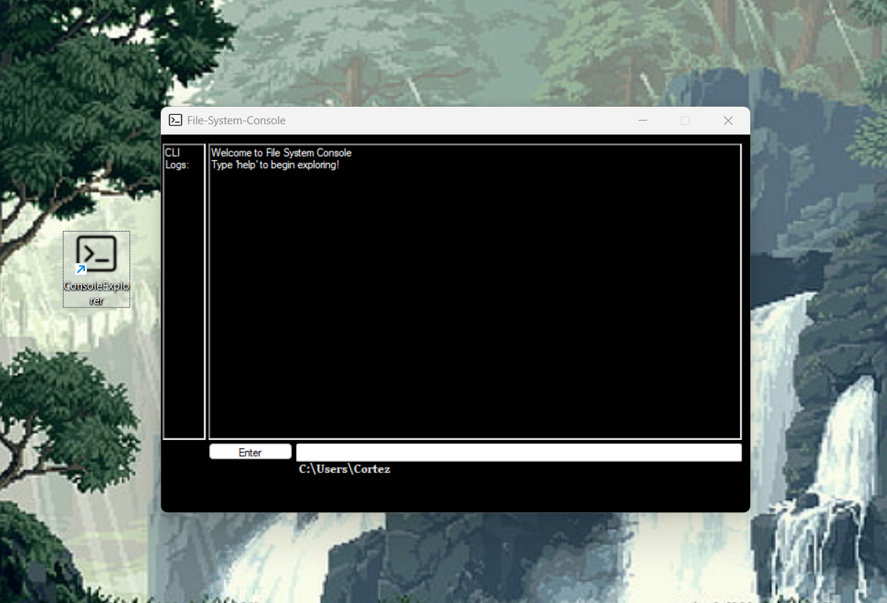

# Console Explorer

**Console Explorer** is a *C#* application made in Visual Studio.
It's sole purpose is to navigate and manage your file system with its
built-in Command-Line interface.

**CE** has a-lot of built-in commands: `current`,`change`,`create`,`copy`,`clear`,`delete`,`echo`,`exit`,`export`,`help`,`list`,`move`.

With those commands, you can freely navigate and manage your File-System with ease.
**CE** also has live logging where you can see if the command you entered is valid or not, and
History persistence so you can see all the commands you entered and shuffle between them using
up and down arrow keys, also it has environmental variable expansion, so you can export and use
your variables in any command with ease.

---

## ScreenShot

---

## Set-up

Setting Up **Console Explorer** is relatively simple. Just go over to the [Releases](https://github.com/patrickcortez/CLi-File-Explorer/releases) and download the latest *Release*.

---

## License

This Application is under GNU General Public License v3, see the LICENSE.txt for more information.